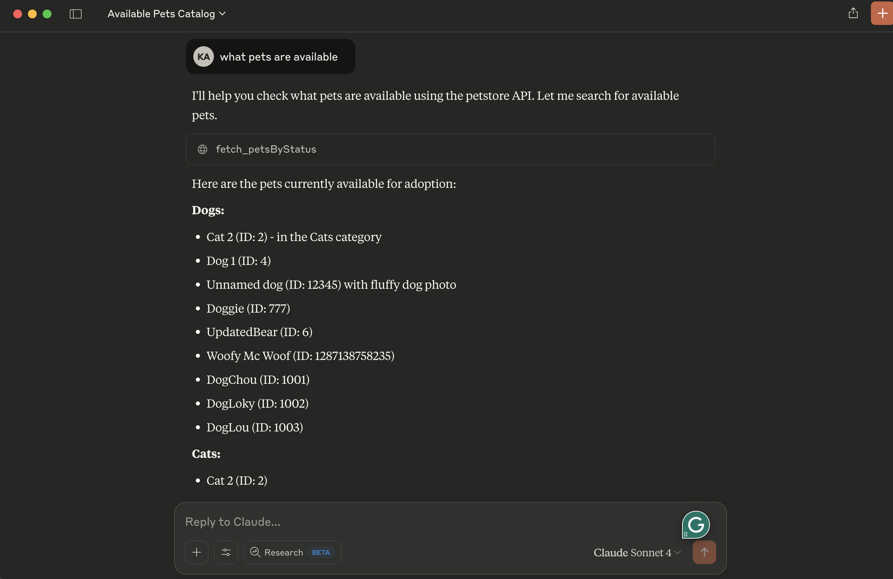

# petclinic-mcp

# Petclinic MCP server
Petclinic MCP server uses petclinic v3 apis (https://petstore3.swagger.io/#/).  It interacts with the Swagger Petstore API (similar to a "PetClinic") and exposes tools to be used by OpenAI models.

It exposes following capabilites
- fetch_petsByStatus: Available status values : available, pending, sold



## Prerequisites
* uv package manager
* Python

## Running locally
* tip use stdio transport to avoid remote server setup.  Change petclinic_mcp_server.py line 39 to use stdio transport
```bash
   mcp.run(transport='stdio')
```
* Clone the project, navigate to the project directory and initiate it with uv:
```bash
    uv init
```
* Create virtual environment and activate it:
```bash
    uv venv
    source .venv/bin/activate
```
* Install dependencies:
```bash
    uv add mcp httpx
```
* Launch the mcp inspector
```bash
npx @modelcontextprotocol/inspector uv run petclinic_mcp_server.py
```
* OR launch the mcp server without inspector
```bash
   uv run petclinic_mcp_server.py
```


## Configuration for Claude Desktop

You will need to supply a configuration for the server for your MCP Client. Here's what the configuration looks like for [claude_desktop_config.json](https://modelcontextprotocol.io/quickstart/user):

```
{
    "mcpServers": {
        
        "filesystem": {
            "command": "npx",
            "args": [
                "-y",
                "@modelcontextprotocol/server-filesystem",
                "/{your-project-path}/petclinic-mcp/"
            ]
        },
        
        "research": {
            "command": "/{your-uv-install-path}/uv",
            "args": [
              "--directory",
              "/{your-project-path}/petclinic-mcp/",
              "run",
              "petclinic_mcp_server.py"]
        },
        
        "fetch": {
            "command": "uvx",
            "args": ["mcp-server-fetch"]
        }
    }
}
```

## Deploy to Cloud Foundry
* tip use sse transport to deploy petclinic mcp server as a remote server.  Change petclinic_mcp_server.py line 39 to use stdio transport
```bash
   mcp.run(transport='sse')
```
* Login to your Cloud Foundry account and push the application
```
cf push -f manifest.yml
```
### Binding to MCP Agents
Model Context Protocol (MCP) servers are lightweight programs that expose specific capabilities to AI models through a standardized interface. These servers act as bridges between LLMs and external tools, data sources, or services, allowing your AI application to perform actions like searching databases, accessing files, or calling external APIs without complex custom integrations.

### Create a user-provided service that provides the URL for an existing MCP server:
```
cf cups petclinic-mcp-server -p '{"mcpServiceURL":"https://your-petclinic-mcp-server.example.com"}'
```
### Bind the MCP service to your application:
```
cf bind-service ai-tool-chat petclinic-mcp-server
```
### Restart your application:
```
cf restart ai-tool-chat
```
Your chatbot will now register with the research MCP agent, and the LLM will be able to invoke the agent's capabilities when responding to chat requests.
